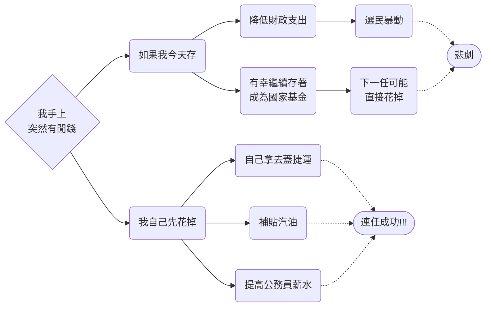
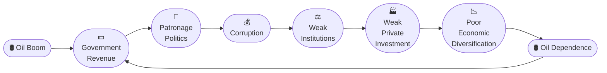
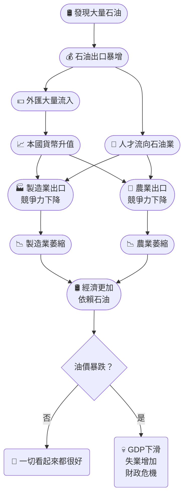
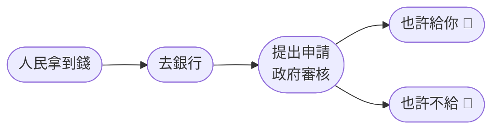
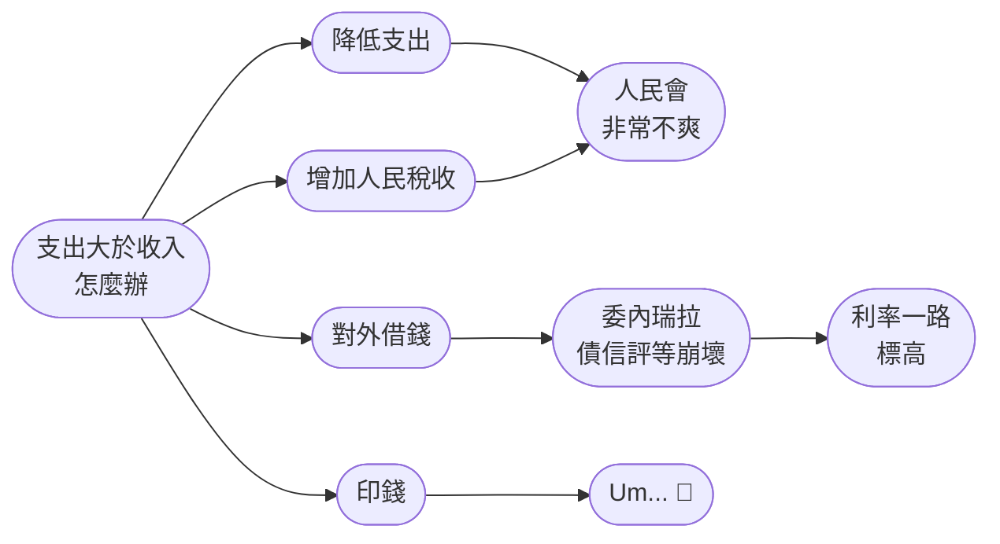

# 🇻🇪 Venezuela Notes
> 到底人們是如何把一手好牌打成這樣的...
## 1. Country Profile
> [!Note]
> ##### 簡而言之
> - 一個坐在世界最大石油儲量上的國家
> - 曾經是拉丁美洲最富有的國家之一
> - 最後卻變成近代最嚴重的經濟崩潰案例之一。 🤣

### 基本訊息[^1]

| Item | Description |
|------|-------------|
| Official name | Bolivarian Republic of Venezuela |
| Capital | Caracas |
| Population | 約900萬（近年略有下降，因大量移民） |
| Area | 約91萬 $km^2$ |
| Language | Spanish |
| Currency | Bolívar (VES) |
| Government | Presidential Republic（實際政治環境具有威權特徵） |
| Major export | Crude Oil（壓倒性第一名） |

[^1]: https://en.wikipedia.org/wiki/Venezuela

### 地理優勢

- 委內瑞拉位於南美洲北部
- 北邊直接面向加勒比海，西邊是哥倫比亞，南邊是巴西，東邊則是蓋亞那
- 由於擁有漫長的加勒比海海岸線，它一直都是重要的石油出口國

> [!Tip]
> - 如果南美洲是一棟房子，委內瑞拉就是面海第一排 🤣
> - 最大的特色: 👉 世界最大的已探明石油儲量（proved oil reserves）
> - 甚至比沙烏地阿拉伯還高 😏


> [!Caution]
> 問題是，有石油 $\ne$ 有錢
> 真正重要的是: 能不能把石油有效率地開採、煉製、出口，以及把收入拿去發展其他產業 🙂

## 2. 金山是如何產生的

> [!Note]
> ##### 簡而言之
> **委內瑞拉其實沒有打仗，但卻靠別人的戰爭賺到盆滿缽滿。** 😈

### 🌍 故事開始
#### 中東開始亂了
- 1973年10月，埃及與敘利亞突然向以色列發動攻擊。由於當天正好是猶太教的重要節日 Yom Kippur（贖罪日），因此歷史上稱為 **Yom Kippur War（贖罪日戰爭）**[^2]

[^2]: https://en.wikipedia.org/wiki/Yom_Kippur_War

#### 美國下場了
- 美國很快開始支援以色列。這讓阿拉伯產油國非常火大。於是他們想到: 既然你支持以色列，那我們就拿石油當武器 😒
- 於是，以沙烏地阿拉伯為首的阿拉伯石油出口國宣布**對美國等支持以色列的國家實施石油禁運（oil embargo）**，同時減少石油產量
- 市場上的石油供應突然大幅下降
- 石油價格直接暴漲，從每桶 **3美元**，一路漲到接近 **12美元**。短短幾個月，**整整漲了將近四倍** [^3]

[^3]: https://en.wikipedia.org/wiki/1973_oil_crisis

#### 伊朗伊斯蘭革命
- 後來發生了第二次石油危機，因為伊朗發生了伊朗伊斯蘭革命 [^4]。伊朗是世界主要產油國之一
- 這導致市場開始恐慌，油價甚至飆升到一桶**27美元** 😱😱

[^4]: https://en.wikipedia.org/wiki/Iranian_Revolution


### meanwhile...

```
( ・_・)

等等。
我也有石油耶。
```

- 委內瑞拉雖然也是石油出口國，但它**不是阿拉伯國家**。因此沒有受到禁運限制
- 市場上的石油變少，但委內瑞拉仍然可以繼續出口
- **出口價格突然翻了好幾倍**，成本沒有增加多少，收入卻像搭火箭一樣衝上去

#### 石油美元開始灌進來
- 政府開始收到大量石油收入，國庫突然變得超有錢
- 政府開始相信 "我們以後都會這麼有錢 😎" ，於是開始... 
    - 大量公共建設
    - 擴大政府支出
    - 增加補貼
    - 增加公務員
    - 推動各種大型發展計畫
- 它突然變成了拉丁美洲最富有的石油國之一，建立了當時拉丁美洲最先進的高速公路和大學城等等

#### 除此之外
- 它還於1976年完全國有化自己的石油，成立**PDVSA**
- 金山讓國家的GDP在短短10年間翻了6倍，同時國企飛速壯大
- 相應的，私有企業進一步萎縮...
- **但是沒關係！你小公司即使不賺錢，也都有政府的補貼可以幫你**　😏


### 總之就是... 🧐
- 剛開始...
```text
━━━━━━━━━━━━━━━━━━━━━━━━━━━━━━━━━━━━━━
VenezuelaOS 1.0
━━━━━━━━━━━━━━━━━━━━━━━━━━━━━━━━━━━━━━

Initializing...
Loading...

[1973.10.17 08:00:00]

systemd[1]: Oil Price Update Detected.

Old Price : $3.29/barrel
New Price : $11.65/barrel

━━━━━━━━━━━━━━━━━━━━━━━━━━━━━━━
Government Revenue
━━━━━━━━━━━━━━━━━━━━━━━━━━━━━━━

███████            35%
██████████████████ 100%

+276%

Status: Money Printer NOT Required.
```

- 然後...
```
[1974]
kernel: Large amount of petrodollars detected.

Loading module...
government_expansion.service
✔ started.

Allocating budget...

Infrastructure.........OK
Healthcare.............OK
Education..............OK
Public Housing.........OK
Subsidies..............OK

Government Spending
↑↑↑↑↑↑↑↑↑↑↑ 😎
```

- 接下來發現...

```text
Government Console
Warning: Private companies are becoming uncompetitive.

Ignore?

[Y] Yes
[N] No

Input:

Y

🫠🫠🫠
```

- 政府表示...
```text
System Notification

Private Industry: "I don't think we can compete anymore...🥺"

Government:

"It's okay."
"I got you."
(:3 )

Subsidy.exe launched.
```

- 因此...

```text
Processes

PID      NAME

100      PDVSA
123      subsidy.service
145      welfare.service
201      price_control.service
234      import_dependency.service
301      vote_support.service

CPU Usage

PDVSA..................91%
Everything Else.........9%

[Background Service]

while (oil_price > high)
{
    government.spend();
    government.expand();
    private_sector.shrink();
}

Status:
Running normally...
No errors detected. 😇
```


## 3. 系統開始問題重重

> [!Note]
> 升息出現，然後開始爆炸 💀

### 拉美債務危機 [^5]
#### Petrodollar Recycling
- 當時一堆石油國家賺了大量的美元，一時不知道要放哪裡，就想說乾脆存進歐美的銀行
- 這下銀行開始不知所措了，這麼多錢要往哪放呢，總不能炒股，乾脆買其他國家的國債吧
- 這讓缺錢的拉丁美洲嗅到了金山的味道，墨西哥、阿根廷、巴西都開始增加自己的發債

> [!Tip]
> - **bank:** 石油目前這麼賺錢，這麼多錢要怎麼投資呢 🧐
> - **latin:** 借給我們可以嗎 🥺
> - **bank:** 好啊老子有的是錢 😎

[^5]: https://en.wikipedia.org/wiki/Latin_American_debt_crisis

#### 應對通膨
- 當時的美聯儲主席Paul Volcker為了應對高通脹，直接大刀一揮，把利息往上抬高...

| 時間 | 聯邦基金利率 | CPI 年增率 | 經濟影響 |
| --- | --- | --- | --- |
| 1979 | 約 11% | 約 11% | 通膨持續惡化 |
| 1980 年底 | **18.9%** | 12.4% | 信貸緊縮，短暫衰退 |
| 1981 年初 | **19.08%** | 仍高於 10% | 失業率開始飆升 |
| 1982 年中 | 約 14% → 開始降息 | 通膨降至 7% | 經濟衰退加深，失業率達**10.8%** |
| 1983 年底 | 約 9% | 通膨降至**3.8%** | 通膨預期打破 |

- 這些拉美國家很多都是借美元的，這下好了，由於多數開發中國家的外債合約與美元利率掛鉤，債務利息瞬間暴增
- 同時加息後，資本開始撤出拉美市場
> [!Note]
> 很多拉美國家借的是浮動利率，所以不是新借的才變貴，而是舊債的利息也跟著往上跳！😱

- 1982年，墨西哥首先宣布自己違約，這導致拉丁美洲債務危機爆發

### meanwhile...
- 其實在1980年代時，國際油價就開始開始暴跌，本來呢委內瑞拉政府還以為這是暫時的
- 所以雖然政政府收入開始下滑，但它並沒有削減之前政府那些冗餘的開支，而是選擇了大肆發債
- 結果現在因為拉美的整個信用開始出現危機，借債也開始難了
- 這下好了，石油價格低，賺不到錢。周圍信用降低，借錢利息又高 🤣

#### 石油價格下跌
- 從原本最高點的**27美元**，跌到不到**10美元** 
- 這也讓它們貨幣 (玻利瓦爾) 的匯率降低，而且由於他們的東西都幾乎靠進口的，所以進口貨價格都翻倍 🫠

### 總之就是...

- 銀行先賺了錢...
```text
[1974]

━━━━━━━━━━━━━━━━━━━━━━━━━━━━━━━━━━
 Global Financial System
━━━━━━━━━━━━━━━━━━━━━━━━━━━━━━━━━━

Oil Price:
████████████████████

Western Banks:

Deposits:
██████████████████████████

Status: Excess liquidity detected.

Recommendation: Find borrowers.
```

- 然後銀行認為...

```text
[1975]

Scanning world...
Developing Countries detected.

━━━━━━━━━━━━━━━━━━━━━━━━━━━━━━

Latin America

GDP Growth...........GOOD
Population...........↑
Infrastructure.......Needs investment
Oil Price............HIGH
Default History......LOW

━━━━━━━━━━━━━━━━━━━━━━━━━━━━━━

Risk Assessment: LOW

Citibank: "Looks safe."
Chase Manhattan: "Approved."
Bank of America: "Approved."
European Banks: "Approved."

```

- 根據當時的情境，大家似乎都很有自信...

```text
[1978]

Issuing syndicated loans...

Mexico...............APPROVED
Brazil...............APPROVED
Argentina............APPROVED
Venezuela............APPROVED
Chile................APPROVED

...

Status: Loans issued successfully.

━━━━━━━━━━━━━━━━━━━━━━

Oil_Crisis_2 module uploded successfully

Oil Price: 
↑↑↑↑↑
```
- 然後，美聯儲開始發現問題...

```text
==================================================
United States
==================================================

WARNING

Inflation exceeded acceptable threshold.
Current CPI: 13.5%

━━━━━━━━━━━━━━━━━━━━━━

Console

Administrator Login

User: Paul Volcker
Authentication: SUCCESS

> increase_interest_rate --aggressive
```

- 因此他們決定...

```text
Loading...
anti_inflation.service

━━━━━━━━━━━━━━━━━━━━━━

Syetem
Federal Funds Rate

5%
↓
8%
↓
12%
↓
17%
↓
20%
```

- 結果觸發了...

```cpp
if (cheap_money == true)
{
    borrow();
    borrow();
    borrow();
}

if (interest_rate == up)
{
    debt_service++;
}

if (export_income == down)
{
    foreign_currency--;
}

if (country == default)
{
    neighbor.risk++;
    bank.confidence--;
}

if (debt_service > cash_flow)
{
    economy.enter(CRISIS);
}
```

### 市場能自己想辦法嗎？🧐
#### 為什麼佩雷斯突然大轉彎？

- 這其實有點戲劇性
- 因為... 佩雷斯 [^6] 第一任（1974-1979），反而就是那個利用石油繁榮大撒幣的人之一 🤣
- 那時候大家甚至說他是 "Saudi Venezuela" 時代的總統，包含大量公共建設、國有化、擴張政府、大量花石油收入
- 所以當他推行市場自由化時，很多人都很驚訝...
> [!Note]
> - Q: "咦？怎麼同一個人第二次執政，突然變成市場自由派？😠"
> - A: 原因其實很現實。第一次的錢 `💰💰💰💰💰` 不同於第二次 `🪙` 🤣🤣

[^6]: https://en.wikipedia.org/wiki/Carlos_Andr%C3%A9s_P%C3%A9rez

#### IMF 的影響
- 1980年代末，很多拉美國家開始接受International Monetary Fund和World Bank提供的改革方案
- 後來大家把這一整套政策稱為 **Washington Consensus（華盛頓共識）** [^7]
- 內容包含但不限於...
   - **放鬆匯率**: 以前政府控制美元價格，改革後讓市場決定
   - **放鬆利率**: 以前政府規定銀行利率，改革後直接不管，交給市場
   - **減少補貼**: 例如汽油、公共運輸、食品等。以前政府還會一直補。改革後慢慢取消
   - **財政緊縮**: 包括減少赤字、減少政府支出
   - **國營企業私有化**
   - **開放外資**

[^7]: https://en.wikipedia.org/wiki/Washington_Consensus


> [!Tip]
> 總之就是他們相信市場可以解決所有經濟問題 🙂

- 因此佩雷斯就突然撒手不管，不願自己修了，乾脆讓市場自己想辦法，又稱為 "El Gran Viraje" [^8]

[^8]: https://es.wikipedia.org/wiki/El_Gran_Viraje

### 那為何不能這樣做？
- 一般來說，你如果要以現代制度經濟學 (institutional economics) 的角度來看，你要有自由的市場，首先應該至少要具備以下原則: 

$$
\text{法治}+\text{契約保障}+\text{穩定政策}+\text{控制腐敗}+\text{市場自由}=\text{私人投資}\uparrow
$$

- 假設今天有一家德國公司想去委內瑞拉蓋工廠。他會問...

> 如果有人違約呢？法院多久判？判決公平嗎？法院能執行嗎？

- 如果國家沒有相應的解決方案，那企業自然會要求更高的風險報酬，甚至乾脆不投資
- 所以很多經濟學家都說 "自由市場需要一個強而可信的法律框架"，政府需要把規則訂清楚，並且持續執行

#### 而且重點是...
- 你把補貼都抽走了，最低工資沒有了，「El Gran Viraje」裡面最具爭議的措施之一，就是**取消燃油、交通、食物等補貼**
- 通常來說，經濟學家有時會區分長期效率 (long-run efficiency)，和短期分配衝擊 (short-run distributional effects)
- 兒長期可能有一些好處: 
   - 減少政府赤字
   - 減少資源浪費
   - 價格反映真實成本
- 但是第一天受到衝擊的是...
   - 通勤的人
   - 低收入家庭
   - 靠公共運輸的人

#### 除此之外
> [!Tip]
> - Q: "如果委內瑞拉早二十年就像挪威一樣，把石油收入存起來，不就好了嗎？" 😑
> - A: "理論上可以，但政治上非常困難。" 🤣

- 民主政治的時間尺度，本身就讓長期投資難以實行。
  - 政府任期：4~5年
  - 石油基金：20~40年投資
- 假設今天你是總統，你有100億美元，一共有兩個方案...
  - 方案A：成立主權基金，20年後受益
  - 方案B：修捷運、蓋高速公路、公務員加薪、補貼汽油、補貼牛奶、明年支持率 +15%
- ...你猜很多政治人物會選哪一個？🤣

#### 下一任選票呢?
- 這也是政治經濟學的一個核心問題，它甚至有一個專門的名詞：**時間不一致問題 (time inconsistency)**
- 意思就是... 今天的政府知道什麼是最好的長期政策，但是它也知道...未來的政府不一定會照做
- 於是現在的政府開始想...



#### 選民呢?
- 選民本身也有影響
- 假設今天政府宣布 "今年石油賺100億"，政府又宣布 "全部存起來當基金"
- 你覺得人民會怎麼回答?

```
「？？？」
「我們現在失業率這麼高，你跟我說先存二十年？」 💀💀
```
- 所以這不是只有政客的問題。民主政治裡，選民也會偏好立即可見的利益

> [!Note]
> 經濟學甚至有個相關概念叫**現在偏誤 (present bias)**，意思是人們往往會高估眼前的好處，低估未來的收益



> [!Note]
> 1989 年的 "加拉加斯暴動"（Caracazo）就是因為民眾無法承受生活成本暴增，街頭抗議演變成大規模暴動，數千人死傷 🫠

### 最後終於下台...
- 佩雷斯據說他動用了國家秘密基金 (約2.5億玻利瓦爾)，用來支付私人開支或不透明的政治用途
- 1993 年，最高法院裁定他有罪，成為委內瑞拉史上第一位因貪汙而被罷免的總統
- 這件事徹底摧毀了人民對傳統政黨的信任，也宣告El Gran Viraje的徹底失敗，同時也為為查韋斯的 "玻利瓦爾革命" 鋪路


### 到底系統是哪裡出現問題?

```cpp
while (oil_price >= HIGH)
{
    spend_money();
    hire_people();
    subsidize_everything();
}
```


```text
Compiler:

Warning:

Expected: else
Received: EOF
```
- 然後就開始炸掉...

```text
Stopping services...

subsidy.service........FAILED
cheap_food.service.....FAILED
government_budget......FAILED
infrastructure.........FAILED
foreign_import.........FAILED
currency_support.......FAILED

CPU Usage

PDVSA..................2%
Government.............100%
Private Sector.........terminated

Allocating budget...
Allocating budget...
Allocating budget...

ERROR:
Revenue unavailable.
Memory leak detected.
Attempting emergency funding...

Emergency Funding Method:

print_money();

✔ executed. 💀
```

- 印鈔之後...

```text
Inflation Monitor

1%
↓
8%
↓
35%
↓
120%
↓
950%
↓
12800%
↓
999999999999999999%

ERROR:
Integer Overflow.

KERNEL PANIC
Unable to maintain currency value.
Reason: Money supply exceeds economic output.
```

- 這導致貨幣Bolívar開始壞掉 🙂

```text
Currency Module

Bolívar

Value:

0.83 USD
↓
0.12 USD
↓
0.01 USD
↓
0.00001 USD
↓
NaN

ERROR:
Floating point exception.
```

- oops

```text
[System Log]

WARNING: Food shortage detected.
WARNING: Medicine shortage detected.
WARNING: Foreign reserves depleted.
WARNING: Brain drain increasing.
WARNING: Hyperinflation accelerating.
WARNING: Public confidence unavailable.
WARNING: Currency authentication failed.
WARNING: National budget corrupted.
WARNING: Economic model entering unrecoverable state.

...
```


```text
[Kernel Panic]

VenezuelaOS 1989

Fatal Exception.

Attempted to execute:
economic_growth()

Received:
NULL

System halted.
```

---

## 4. Chávez 上台
### 前情提要...
- 當時的委內瑞拉已經經歷了...
  - 1983 貨幣危機
  - 1989 Caracazo
  - 1992 政變
  - 1993 總統遭彈劾
  - 1994 銀行危機
  - 兩大政黨互相推鍋
> [!Tip]
> ##### 人民表示: 
> 還有正常人嗎？？？ 💀🤣

#### 主角飛升之路
- 查維茲[^9]原本是陸軍中校，1980 年代末期就對傳統政黨的腐敗和 "El Gran Viraje" 的痛苦改革不滿
- 更早以前，他就在軍中秘密成立了一個組織: **MBR-200 Movimiento Bolivariano Revolucionario-200** (玻利瓦革命運動200)
- 理念很簡單: "現在這個政治制度已經腐敗了"，所以他一直在等待時機
- 1992 年，查維茲決定梭哈
- 他直接發動政變，目標很簡單: 推翻 Carlos Andrés Pérez
- 但是...失敗。🤣
- 雖然失敗，但在電視上那句——

> **"Por ahora (暫時失敗，明日再戰)"** 

- ... 讓他成為民眾心中的反體制象徵
- 畢竟嘛，你想當時對這個政府腐敗失望透頂的民眾，肯定希望有一個強權的領導人能夠改變現狀，於是查維斯就在民意支持下上台

[^9]: https://en.wikipedia.org/wiki/Hugo_Ch%C3%A1vez

### 上台之後...
- 第一件事就是改國名，將國名改成 "委內瑞拉玻利瓦爾共和國"
- 首先， Chávez 一開始不是因為熟讀馬克思才從政 (雖然大家覺得他是社會主義者)，而是一位民族主義軍官，因為對既有政治體制失望而走上政治舞台
- 是到後來隨著執政、國內衝突和國際局勢變化，他的思想逐漸向左發展，最後以 "21世紀社會主義" 作為自己的政治旗幟

> [!Warning]
> 總之這個社會主義跟馬克思可能沒有什麼關係... 🤣

- 如果要看看查維茲的社會主義，長得可能像是...

```cpp
class TwentyFirstCenturySocialism : public Socialism
{
public:
    void add()
    {
        nationalism++;
        antiImperialism++;
        oilRevenue++;
        Bolivar++;
        charisma++;
    }
};
```
> [!Tip]
> Karl Marx: **"......Who approved this pull request? 💀"**

### 玻利瓦爾革命

- 說到這，**Simón Bolívar** 這個人，是 19 世紀南美洲最重要的獨立運動領袖之一[^10]
- 如果美國有 George Washington，那拉丁美洲很多國家眼中的 Bolívar 就有點像**解放者 (El Libertador)**


- 他當時領導或協助了今天的各南美洲國家脫離西班牙的統治
- 由於Bolívar在委內瑞拉幾乎就是民族英雄，所以 Chávez 很聰明。他沒有說 "我要建立 Marx Republic"，而是說... 

> **"我要完成 Bolívar 沒完成的夢想"** 😎

- 因次 1999 年新憲法之後，原本的 Republic of Venezuela，變成 **Bolivarian Republic of Venezuela**，根本就是直接把 Bolívar 寫進國名了 🤣

[^10]: https://en.wikipedia.org/wiki/Sim%C3%B3n_Bol%C3%ADvar

#### 那玻利瓦爾的夢想是什麼?
> [!Note]
> 日本有大東亞共榮圈，玻利瓦爾有... Gran Colombia 理想 😏

- 玻利瓦爾希望把南美洲北部 (也就是今日的委內瑞拉、哥倫比亞、厄瓜多爾、巴拿馬等等) 整合成一個大國，這又被稱為**Gran Colombia 理想**
- 反殖民、反西班牙帝國，強調拉美團結，強調政治整合 + 軍事解放

| 相似點 | 差異 |
| --- | --- |
| 都是區域整合的宏大願景 | 日本的是帝國擴張，玻利瓦爾的是反殖民 |
| 都用共同繁榮/團結的語言 | 日本強調「亞洲排西方」，玻利瓦爾強調「拉美排西班牙」 |
| 都需要強力領袖推動 | 日本靠軍事霸權，玻利瓦爾靠解放軍與政治理想 |


#### 具體的革命在幹什麼
- 他說要給國家進行一個大改造，史稱 **Bolivarian Revolution**

> - 委內瑞拉之所以之前能如此混亂，主要是因為外面那些資本主義的侵蝕。他們把我們的石油資源換來的財富，想辦法變成自己的利潤。什麼通貨膨脹... 這哪是什麼自然的經濟現象，這就是萬惡的資本主義，敵對勢力在搞鬼。這就是他們的陰謀！
> <br> *—— Hugo Chávez*

- 把西蒙·玻利瓦爾當作精神象徵，包裝成 "反帝國主義、反精英、人民至上" 的革命，內容包含但不限於...
   - 石油國有化再強化，國家直接掌控 PDVSA (等下會談到)
   - 對外宣稱 "反新自由主義"，拒絕 IMF/世界銀行的結構調整
   - 反美、反帝國主義，推動 "拉美團結"
   - 強調**人民 vs. 精英**的敘事，把自己塑造成窮人的代言人

> [!Note]
> 這種敘事就是典型的民粹主義 😏

#### btw, what is populism?
- 通常來說，Populism [^11] 的標準配置包含但不限於...
   - 社會被劃分成 **"純潔的人民" vs. "腐敗的精英"**，政治衝突被簡化成這兩者的對立，而不是複雜的政策辯論
   - 強調自己是 **"人民的代言人"**，把反對派描繪成既得利益集團。Populist 領袖自稱是 "人民的唯一代言人"
   - 常常直接挑戰制度 (法院、國會、媒體)，認為這些都是精英的工具
   - 除了國內精英的 **"內部敵人"**，還常常加上 **"外部敵人"**

[^11]: https://en.wikipedia.org/wiki/Populism

> [!Important]
> ##### 這裡有幾個重點必記...
> - **強人領導 ≠ 革命必然**
>   - Populist 領袖不一定靠政變或革命上台，很多是透過正規民主選舉
>   - 查維斯在 1998 年是透過選票當選；川普、奧班、杜特爾特也都是透過民主程序上台
> - **左右派皆可套用**
>   - Populism 是一種「薄層意識形態」 (thin-centered ideology)，可以和左派或右派結合
>   - 左派 populism 強調資源再分配、反資本主義
>   - 右派 populism 強調民族主義、反移民、反全球化
> - **直接訴諸人民**
>   - 領袖自稱是「唯一合法的代言人」，把自己和人民綁在一起

#### 讓我們來聽聽 Yuval Harari [^12] 怎麼說...

> - Populism來自populus，意指 "人民" ，在民主政體，會認為人民是政治權威的唯一合法來源，也只有民意代表有權宣戰、立法、增稅。Populist雖然也相信這項民主基本原則，卻不知道從哪裡得來的結論，覺得此言意指該由單一政黨或是單一領導人壟斷所有權力... 根據看似無可挑剔的民主原則，發展出一套追求無限權力的極權主義。事情究竟是怎麼發展成這樣的？
> - 在民主政體，政治權力應該僅能歸於人民，而如果只有 populist 才能代表人民，自然所有政治權力都要歸於populism政黨。如果是其他政黨贏下選舉，可不是代表該政黨贏得人民信任、有權組成政府，肯定是勝選被偷走了，或是人民被欺騙了。投票結果並未表達人民真正的意願。
> - 如果民粹主義者說，根本沒有人在乎真理和正義，那難道他們認為墨索里尼、普丁不是人嗎？如果populist認為沒有人類機構可以有效自我修正，權力才是唯一的現實，難道義大利的法西斯黨，統一俄羅斯黨不是人類機構嗎？一邊堅決否定所有菁英份子跟機構，一邊又堅信某位領導者或是政黨，這不是自相矛盾嗎？正因如此，populism最終還是要回到 **"強人代表所有人民"** 這種神話般虛無飄渺的概念。 [^13]
> <br>*—— Yuval Noah Harari*

[^12]: https://en.wikipedia.org/wiki/Yuval_Noah_Harari


[^13]: https://en.wikipedia.org/wiki/Nexus:_A_Brief_History_of_Information_Networks_from_the_Stone_Age_to_AI

### 整理成程式碼就是... 🤣

```cpp
class Populism
{
public:

    bool peopleAreSovereign()
    {
        return true;
    }

    bool IRepresentPeople()
    {
        return true;
    }

    bool oppositionRepresentsPeople()
    {
        return false;
    }

    void election(Result r)
    {
        if (r.winner() == me)
            celebrate();

        else
            claimFraud();
    }
};
```

## 5. 國有化的代價
### 石油怎麼回事?
- 佩雷斯第一次執政時，其實就宣布石油國有化，成立 PDVSA，但是，雖然是國營公司，但運作方式很像跨國石油公司，管理層相對獨立，技術和財務上保持專業化
- 這導致PDVSA 在 1980–90 年代被稱為 **"國家中的國家 (A state within a state)"**，甚至比政府更有效率

#### 再國有化的命運
- Chávez 非常討厭這件事，他認為: **"石油屬於人民的，那我代表人民，石油的交易就要歸我管"** (又來這一套邏輯？！ 💀)
- 但 PDVSA 高層則比較傾向: **"我們屬於公司，少受政府干預才能提高效率"** (小政府對我們當然更好 🧐)
- 這導致了衝突爆發...

#### 罷工活動開始
- 2002 年底，反對派要求查韋斯下台，PDVSA 的管理層和工會加入抗議，發動大規模罷工 [^14]
- 這其中就包含管理層、工程師、技術人員等等
- 罷工持續了約兩個月，石油出口幾乎停擺，產量從原來的300萬桶，跌到了每天不到30萬桶，國家收入瞬間崩塌

#### 總統該如何反應呢?
- Chávez 回來後，直接...

```cpp
for (Employee e : PDVSA)
{
    if (e.joinedStrike())
        fire(e);
}
```

[^14]: https://foreignpolicy.com/2018/07/16/how-venezuela-struck-it-poor-oil-energy-chavez/

> 你們不是罷工嗎？不是不幹活嗎？那你們以後也不用來了，全開掉。🙂🙂

- 但凡上街的一律裁掉。查韋斯趁機清洗 PDVSA，他一次解雇了約 18,000 名員工，其中包括大量管理和技術人員，占當時 PDVSA 員工總數約四成，並換上忠於政府的人
- 最後，查維斯雖然贏了，但代價是 PDVSA 的專業性被摧毀，長期拖垮了委內瑞拉的石油產業
- 隨著設備老化，技術流失，維護能力喪失，它的開採能力因此大幅下降。這石油放那就讓你挖，它就是挖不出來 🫠
- 與此同時，委內瑞拉很多油不是 "很好挖" 的。它有大量位於 Orinoco Belt 的超重質原油 (extra-heavy crude) [^15]
   - 中東部分油田: 🛢️ (流動性很好~ 😇)
   - 委內瑞拉油田: 🍯(...這是瀝青嗎?? 🤣)

> [!Important]
> **Reserves（儲量）≠ Production（產量）** 🧐

[^15]: https://www.piping-designer.com/disciplines/mechanical/896-petroleum-engineering/4076-extra-heavy-crude

### 那銀行怎麼回事?
- 委內瑞拉有自己的中央銀行—— **Central Bank of Venezuela (BCV)**，理論上，它應該做的事情跟很多國家的央行差不多...

```cpp
class CentralBank
{
public:

    void controlInflation();
    void maintainCurrency();
    void manageReserves();
    void issueMoney();
};
```

- 但是發行貨幣時，也就是執行 `issueMoney()` 函式時，盡量不是總統說什麼你就做什麼
- 畢竟如果政府缺錢就可以一直print，事情可能不太妙就是了 💀
- 因此經濟學家才會強調**中央銀行獨立性 (Central Bank Independence)**，政府不能隨便命令央行印鈔

#### 但是...
- 查維茲透過幾次法律的頒布，例如讓中央銀行的一部分盈餘、外匯收入、以及一些本來比較獨立管理的資金，開始更容易被政府調度
- 很多經濟學家認為，BCV 的實際獨立性，在多次的修法中逐漸下降了
- 這也為後來 Nicolás Maduro 的印鈔，埋下了伏筆，形成了以下的政府決策型態...

```cpp
class Government
{
public:

    void solveBudgetDeficit()
    {
        if (oilPrice > 100)
            return;

        if (canBorrow())
            borrow();

        else if (canCutSpending())
            cutSpending();

        else if (canRaiseTaxes())
            raiseTaxes();

        else
            centralBank.printMoney();
    }
};
```

- 這也導致後來一旦政府出現財政赤字，就有能力開動印鈔機。這也導致後來的惡性通膨更加惡化 😱

## 6. Dutch Disease [^16]

> [!Note] 
> 石油太成功，成功到把其他產業都壓死了 💀

- 這個概念最早是用來解釋荷蘭在 1960–70 年代因天然氣出口繁榮，卻導致其他產業衰退的現象
- 一個 **"資源繁榮 → 經濟失衡"** 的因果鏈

### 邏輯鏈長怎樣?
#### 資源繁榮
- 一個國家發現或出口大量自然資源 (例如石油、天然氣、礦產)
- 這些資源出口，帶來巨額外匯收入

#### 貨幣升值
- 外匯流入會導致本國貨幣升值
- 這代表國人到國外的購買力上升 (買國外的東西變便宜)，但這也代表本國的出口商品在國際市場上變得更貴

#### 製造業/農業衰退
- 這導致傳統出口產業 (製造業、農業) 失去競爭力，你車子跟電器都比其他國家貴，誰要買你的？
- 負責開採自然資源的部門吸走勞動力與資本，其他部門被擠壓，導致它們逐漸退化

#### 財政依賴與波動
- 經濟過度依賴資源部門，其餘 "非資源部門" 萎縮，創新與多元化能力下降
- 由於此時政府收入高度依賴資源出口，當資源價格下跌，便容易導致財政危機
- 經濟失衡、失業增加、制度脆弱等影響，長期容易引發政治不穩與社會動盪

[^16]: https://www.economicsonline.co.uk/definitions/dutch-disease.html/

### 如果畫成以下的話... 🤣
- 亂寫程式碼就是...

```cpp
class Venezuela
{
public:

    Economy economy;

    void discoverOil()
    {
        economy.oil++;
        economy.manufacturing--;
        economy.agriculture--;
        economy.exports =
            economy.oil;
    }
};

if (oilPrice == LOW)
{
    panic(😱😱);
}
```

- 寫流程圖就是...



> [!Tip]
> - 如果一個國家在石油繁榮時，仍然持續投資製造業、農業、教育、科技和其他出口產業，那它就**不一定會得荷蘭病**
> - 關鍵不是有沒有石油，而是經濟最後是不是變成 **"GDP幾乎等於石油出口"** 🧐

### 那查維茲如何解決問題?
- 當時的經濟問題，一是投資者看到總統這樣一搞，全都撤離。同時國內的民眾也對本國的貨幣不信任，一拿到波利瓦爾就打算換成外幣
- 這導致兩個現象: **"匯率下跌"** 以及 **"物價上漲"**

#### 匯率下跌解法: 固定匯率 (Exchange Controls)
- 在石油罷工和資本外流之後，政府建立了嚴格的外匯管制制度
- 以前民眾的做法可能是...


- 現在變成了...



- 政府的想法其實不難理解。如果大家一直把 Bolívar 換成美元，本國貨幣就更容易貶值。所以...

> [!Note]
> - 政府: "那就不要讓大家自由換美元。🙂🙂"
> - 人民: "🙂🙂🙂🙂"

#### 物價上漲解法: 價格管制 (Price Controls)
- 政府規定了多種物資的價格上限，並且這些管制還訂入了法律，導致說如果沒有按照價格賣，就會被視為違法...

```cpp
if(price > government.maximumPrice)
{
    illegal();
}
```

- 聽起來不是很好嗎？對消費者來說是這樣，但是這恰好破壞了市場機制，因為你嚴格定義價格，生產者反而無利可圖
- 如果這筆交易的價值連成本都賠不上，我還賣甚麼賣？這導致市場上的商品供應減少

> [!Note]
> 不是大家不想賣。而是...... 賣一盒虧一盒阿 😭😭

- 由於市場上短缺，物資最後只能偷偷背著政府，用更高的價格賣出。而且由於它們的**價格高於政府的價格上限，因此屬於 "黑市"**

### 結果就是...
#### 商品短缺加劇
- 價格被壓低，生產者無利可圖，減少供應
- 消費者需求卻因低價增加，導致供不應求更嚴重


#### 黑市壯大
- 官方價格太低，商品消失在合法市場，黑市成為唯一管道
- 黑市價格往往比自由市場更高，這導致通膨反而惡化

#### 貨幣信任崩潰
- 官方匯率與黑市匯率差距擴大，導致人民不再相信本幣
- 外匯管制導致美元稀缺，人民更容易轉向黑市交易
- 目前的委內瑞拉的經濟也逐漸美元化當中

#### 投資進一步萎縮
- 價格管制打擊企業利潤，投資意願更加下降
- 長期導致生產能力崩潰，供應鏈斷裂


## 7. 神跡降臨又消失
### 金山回來了
- Chávez其實搭上了一波超級景氣。如果你去看當年的國際油價，大概會發現... 
   - 1998🛢️ 約**10~20美元/桶**
   - 2008🛢️ 一度超過**140美元/桶**
- 這可是接近十倍的增長阿。由於委內瑞拉政府收入 90% 以上來自石油，政府的財政瞬間充裕 🤩🤩
- 所以就算產量下降了... 沒關係，現在就算生產的不多，折合成現金還是很多錢嘛 😎

#### Misiones
- Chávez用油錢加碼 "社會任務" (Misiones)，教育、醫療、糧食補貼、水電幾乎免費、住宅規劃等等
- 很多以前根本享受不到公共服務的人，第一次真的受惠。因此短期內改善了貧困率，民眾感覺 "生活真的變好了"
- 除此之外，政府的部門隨著國有化的範圍變大，而傳統產因 Dutch Disease 式衰退而萎縮，再加上政府開支也一起變多，政府部門成了主要的就業出口，吸收失業人口
- 政府的公共建設，例如修路、建築、公立教育，也需要更多專業人士的幫忙，創造大量就業機會
- 當地有大概**四分之一的人口**，在政府的部門底下工作

> [!Tip]
> 政府本身，變成了全國最大的雇主之一 😏

#### 匯率與通膨
- 有了美元收入，官方匯率能維持一段時間
- 補貼壓低了部分物價，讓通膨看起來比較可控

### 花了就是賺了?
- 當時Chávez為了促進大家貸款，因此設置了一個利率上限
- 當時的信用卡借貸利率約為29%，聽起來很高，但其實當時的狀況是: 

$$\text{借貸利率}<\text{通貨膨脹率}$$

- 在經濟學家眼中，名目利率不等於實質利率。在當時的委內瑞拉，名目利率是29%，但是實質利率的公式為...

$$\text{實質利率}=\text{名目利率}-\text{通貨膨脹率}$$

- 因此...

$$
\begin{align}
& \text{名目利率}=29\% \\
& \text{通貨膨脹率}\approx 30\% \text{~} 50\% \\
\therefore \quad & \text{實質利率} \approx -1\%\text{~} -21\%
\end{align}
$$

- 也就是說，相對於存錢 (假如說存錢的利率很低)，你實際上比貸款還要虧 [^17]

[^17]: https://fastercapital.com/content/Negative-real-interest-rates--Unmasking-Financial-Repression-s-Hidden-Cost.html

#### 讓我們來舉個例子...
- 假如說你是個委內瑞拉人，當時一年期貸款利率為29%，而年化通膨為40%
- 你在借到了100000玻利瓦爾之後，立刻就去把它拿去買食物，買水，買電器，總之，買你能想到的東西
- 一年之後，這些物資的價格上升到140000玻利瓦爾，但是你現在還款期只需還129000
- 這不就相當於你賺了嗎?? 😲

#### 當然這對銀行來說...
> holy shit那我們賺什麼嘛 😑😑
- 因此後來有些私人銀行，就不把放貸當成賺錢手段。畢竟，假設我是委內瑞拉銀行，我看到...

```text
信用卡利率29%
通膨40%
```
- 我心裡第一句就是...

> 「借個屁。」🙂🙂

- 因此銀行可能會把錢投資到別的更好賺的地方，例如...

```cpp
riskFreeAsset++;
foreignAsset++;
shortTermAsset++;
```
- 但是還有一個問題，你要是銀行經理，看到這買東西的風氣這麼盛行，資金週轉速度越來越快，你總不希望把錢拿去買了多張30年國債，結果庫存裡面沒多少現金給人民取
- 如果今天有100個人一起來領錢。銀行總不能說 **"等2056年我的美國國債到期再給你🙂"**，不行嘛 
- 因此銀行此時會追求的就是...

```cpp
TreasuryBill(3 months);
TreasuryBill(6 months);
TreasuryBill(1 year);
cash++;
```
- 高通膨、高不確定性環境下，銀行會開始縮短資產的duration，不是因為短期一定比較賺，而是 **"我不知道三十年後銀行還在不在 🫠🫠"**

> [!Note]
> 所以銀行真正看的不是能不能賺，而是 "能不能今天就變現"，這叫 **Liquidity (流動性)** 🧐

#### 越危險，越短視近利
- 在經濟危機或資金周轉速度極快的環境下，公司和銀行往往會選擇那些duration較短的東西，而不會注重於長期投資

|現象|高通膨環境|負實際利率|資金周轉壓力|
|---|---|---|---|
|**內部邏輯**|錢的價值快速流失，導致長期投資回報不穩|借貸利率 < 通膨率，因此實際上借款人 "賺到"，存款人 "虧損" |政府設匯率、價格、利率管制，讓市場失去長期規劃的誘因|
|**解決方案**|企業和銀行傾向於追求短期現金流，而不是長期建設|銀行減少或是被迫放貸，卻知道實質回收價值會縮水，乾脆追求短期利潤或政策補貼|銀行和企業只想 "如何在規則下活下來"，而不是 "如何長期成長"|

### 接下燙手山芋的倒楣接班人
- 2013年，這個號稱帶著玻利瓦爾的意志走過一生的Chávez因為癌症而去世
- 他在位期間利用高油價給人民的生活帶來實質的好處，然後他的接班人來了，但我得說，這個接班人有點衰 🙂🙂
- 他的繼任者，也是同樣來自統一社會黨的 Nicolás Maduro [^18] 可就沒那麼幸運了
- 他幾乎是剛一上台，還沒開始習慣CEO的位置，油價就開始掉頭下跌...

[^18]: https://en.wikipedia.org/wiki/Nicol%C3%A1s_Maduro

```cpp
class Presidency
{
public:

    President chavez;
    chavez.receive(oilPrice = 120);
    President maduro;
    maduro.receive(oilPrice = 45);
};

System message: 
"你他媽的 🙂"
```

#### 🛢️ 供給面因素
- 美國頁岩油的增產，水力壓裂技術成熟，生產成本下降，美國原油供給急速增加
- 沙烏地阿拉伯等主要產油國選擇維持產量，OPEC最終決定不願減產來支撐油價，意圖打壓高成本的頁岩油商
- 這導致 2014–2016 年間，市場每天供給超過需求約 100–200 萬桶 (媽的這根本就是Maduro剛上台的時間阿 🤣🤣)

#### 📉 需求面因素
- 中國、巴西、俄羅斯等國經濟成長開始放緩，石油需求減弱
- 同時，美元升值使以美元計價的石油更昂貴，壓抑需求

### Maduro 的難題 
#### 財政問題
- 由於整個政府的財政收入都幾乎是 `governmentRevenue = oilRevenue` ，因此當油價縮水，政府手上的財產也會縮水。但是... 支出呢?

```cpp
salary = fixed;
subsidy = fixed;
healthcare = fixed;
foodProgram = fixed;
```

- 你總不能跟大眾說 "我把你們的福利砍了自己洗洗睡 🙂" 吧?
- 好，所以 Maduro 目前有幾條路可以走，如下: 



#### 金融的制裁
- 2014 年，美國最早的一波措施主要是針對部分政府官員，理由涉及人權與政治衝突
- 真正開始傷筋動骨的是後面幾年。尤其是 2017 年之後，開始限制它在國際市場借錢...

> [!Tip]
> - Venezuela: 借個美元 🥺
> - 國際金融市場: nope. 🙂

#### 石油禁出口
- 美國對國營石油公司 PDVSA 制裁，石油還是能賣給部分其他國家，但出口、收款、金融往來都變得困難得多
  - 美國可以規定美國公司不要跟PDVSA交易跟簽合約
  - 由於石油需要由美元交易，中間需要美國的銀行幫忙，美國可以從中罰銀行，間接使銀行增加交易難度
- 這導致委內瑞拉 "出口石油，換美元" 的路變的很難走 🫠

```cpp
class Maduro
{
public:

    void startGame()
    {
        oilPrice /= 2;
        inflation++;
        foreignReserve--;
        politicalConflict++;
        sanctions++;
        opposition++;
        budget--;
        std::cout
            << "Good luck. (:3 ) \n";
    }
};
```
> [!Note]
> - 間接制裁石油讓它**賺不到錢**
> - 限制融資讓它**借不到錢**
> - 就是**讓你沒錢** 🙂

- 這一系列制裁，讓後面的委國GDP一度跌到很可怕的位置...


### 總之就是...

```text
==========================================
VENEZUELA OS
Version: 2014.0
Kernel: chavismo-lts
==========================================

08:00:01
Booting government...

[ OK ]

08:00:03
Loading budget...
Revenue:
████████████████████ 100%

[ OK ]

08:31:42
Oil price updated.

Old:$108
New:$55

WARNING
Revenue reduced by 49%.
```

- 因此國家嘗試自動修復...

```text
Launching Budget Recovery Wizard...

[1] Cut spending
[2] Raise taxes
[3] Borrow money
[4] Print money
```

- 嘗試借錢...

```text
Selected:
[3] Borrow money

Connecting to international market...
Connecting...
Connecting...


ERROR
Access denied.

Reason:
Credit unavailable.

Retry...

ERROR
Retry failed.
```

- 於是 Maduro 只能開起備用方案...

```text
Fallback selected:
Print money

Loading money-printer.service...

[ OK ]

Money printer initialized.

Temperature:

32°C
↓
61°C
↓
89°C
↓
126°C

...

Cooling system unavailable.

...

CRITICAL
Inflation no longer unexpected.
```

- 由於高物價導致的通貨膨脹...

```text
===================================

CRITICAL

Oil revenue: 
LOW

Foreign reserves: 
LOW

Imports: 
LOW

Food supply: 
LOW

Currency value:
LOW

Public confidence:
LOW

...

===================================

System recommendation:
Have you tried turning the economy off and on again?

y

ERROR
Permission denied.

🫠🫠🫠
```

### 當時的通貨膨脹率有多可怕
- 根據咱們的維基百科大大 [^19]，公開的數據大概就是長...

|年份|CPI (%)|
|---|---|
|2013|56|
|2014|69|
|2015|181|
|2016|274|
|2017|863|
|2018|130060|
|2019|9586|
|2020|2296|
|2021|687|
|2022|234|

[^19]: https://en.wikipedia.org/wiki/Hyperinflation_in_Venezuela

- 對於當時的人來說，薪水一入帳，很多人不是先存銀行，而是立刻把它換成商品或美元。在那樣的環境裡，現金本身反而成了最不想持有的東西
- 同時，政府推貨幣的速度也是跟著一起上去...

|發行年份|原本舊貨幣|對應新貨幣|
|---|----|---|
|2008|1000 Bolívar|1 strong bolívar|
|2018|100000 strong bolívar|1 Sovereign Bolívar|
|2021|1000000 Sovereign Bolívar|1 Digital Bolívar|

- 翻譯過來就是...

$$1\ \text{Digital Bolívar}=10^{14}\ \text{Bolívar}$$


## 8. 總結
> - ...這就很像一個心智還不太成熟的小孩，他也會犯錯，也會迷茫，但是，他如果上來就擁有天文數字的財富，那這個糾錯機制，很可能就會失靈。小的經濟失衡，小的腐敗現像，小的價格扭曲，在源源不斷的財富流入的環境下，沒能得到及時的反饋，就會越走越偏，離正道越來越遠。等到他已經病入膏肓的時候，油價再一旦暴跌，遭到反噬，就會進入惡性循環。
> <br> *—— Lindsay* [^20]
> 
> - ...el petróleo nos traerá la ruina. Es el excremento del diablo.
> <br> *—— Juan Pablo Pérez Alfonzo* [^21]

> [!Tip]
> 既然都講到這裡了，那就來看看底下的互動圖表吧，不玩白不玩 🐱🐱🐱

<iframe src="https://Jacklyn301.github.io/note_of_selflearning/Brent%20Oil%20Price%20and%20Venezuela%20Timeline.html" width="100%" height="900px"></iframe>

[^20]: https://www.youtube.com/@xiao_lin_shuo
[^21]: https://en.wikipedia.org/wiki/Juan_Pablo_P%C3%A9rez_Alfonzo