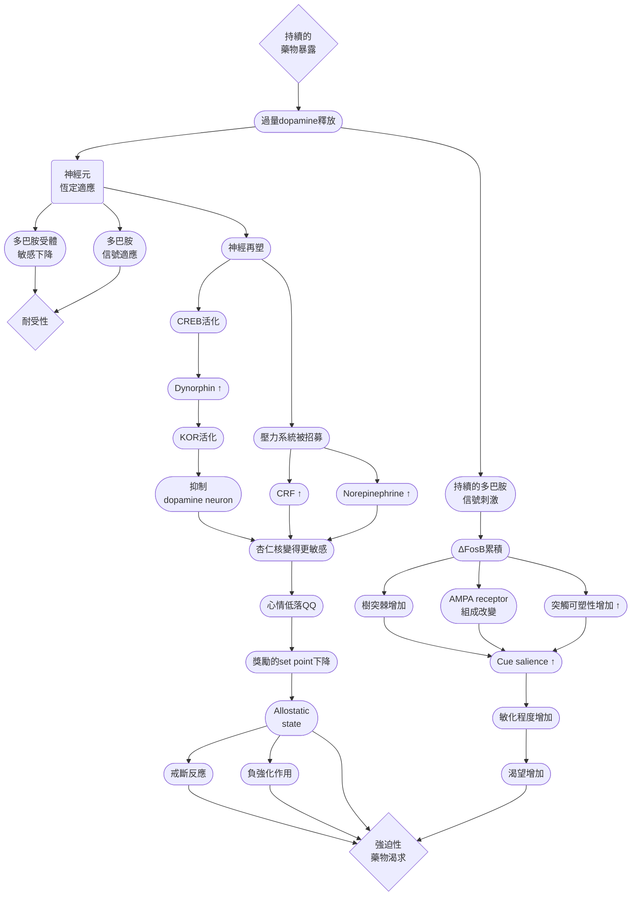
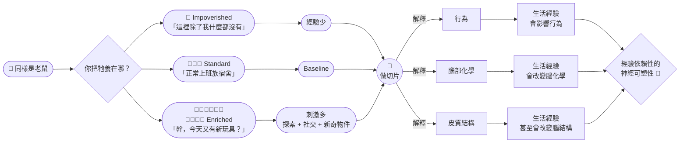
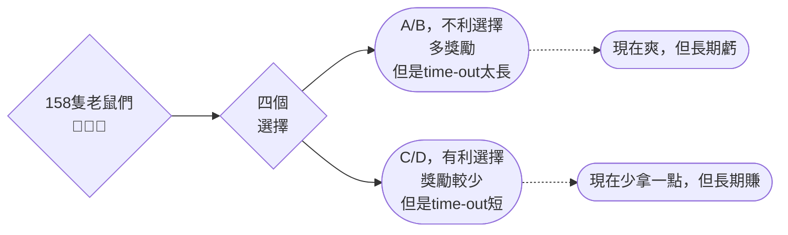
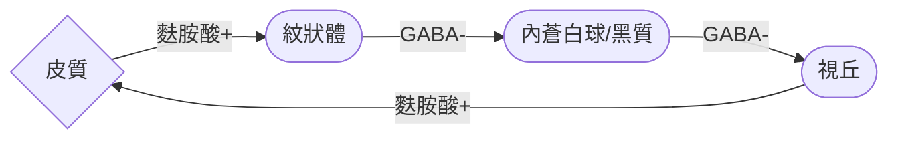
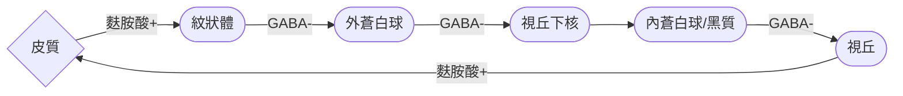

# the overall note of addiction
## 1. 非藥物型的成癮

> [!Tip]
> **詳細內容請見以下**: 10.1016/j.neuropharm.2011.03.010

### 前情提要 🐱
- 非藥物成癮跟藥物成癮的可塑性之間存在相似處
- 反覆刺激會誘導神經可塑性，進而抑制或是促進成癮行為
- 多數人常常受到的並非物質成癮，而是行為成癮 (aka 非物質成癮)
- 這包含衝動購物、飲食、運動 (嗯，有人運動上癮)、賭博、電子遊戲、性行為等等
- 舉個栗子 😈
   - 賭博成癮盛行率可以到1%至2%
   - 性成癮約5%
   - 暴飲暴食問題約2.8%
   - 衝動購物可以到6%左右

#### DSM-IV 的定義
- 第四版的DSM通常是承認有成癮行為，但不一定會記錄在手冊上，也不一定構成病理上的成癮 (因為快要用爛了 🫠)，所以頂多叫做濫用or依賴，不算成癮
- 不過，近年來各位大大也開始認為行為成癮類似物質成癮的一些行為
- 因此在修訂第五版時，便提議增加了 "行為成癮" 的類別
- 非藥物成癮也表現出相似的心理和行為模式，包括強烈的渴望、行為控制的障礙、耐受性、戒斷反應以及高複發率
- 各種自然獎勵 (或是不自然的行為獎勵，呵呵)，也會活化中腦邊緣回路，以及杏仁核的延伸區域
- 神經可塑性被認為是成癮行為的重大推手，在動物實驗中可以觀察神經遞質水平的改變、細胞形態的改變、以及轉錄活動

### 成癮理論小介紹 🧐
#### sensitization / reverse tolerance
- 重複的藥物暴露會導致藥物，及其相關處發線索的獎賞機制敏感化。這是由於NAc接收到的dopamine不正常增加導致
- 行為上，這與接觸與攝入相關的線索時，增加對藥物的渴望和欲求有關

> [!Note]
> 例如你站在某個街角就毒癮發作，或是看到針頭就突然想來打一針 🙂

- 患者在服用多巴胺類藥物後，對非藥物獎勵的參與度增加
- PD患者會用L-Dopa這個多巴胺前驅物，來增加患者腦內多巴胺水平 (BTW，帕金森氏症是因為黑質的神經元異常導致多巴胺分泌不足。其觸發運動神經元)
- L-Dopa 進入腦內後，沒有辦法只修復 nigrostriatal pathway
- 它會影響多個 dopaminergic pathway。所以就出現一件很好笑的可能性...

> [!Tip]
> - 有些病人以前完全不賭
> - 開始吃 dopamine agonist
> - 半年後...
> - 老婆：「醫生，我先生把退休金輸光了。🙂」

#### 正強化解析
- Positive Reinforcement的定義是: 某個行為產生了一個愉快或具有獎勵性的結果，因此未來更容易再次做出這個行為，此時VTA會釋放dopamine，NAc接收到後，開始向各處發送這個訊息，包含: 
   - Hippocampus 記住地點
   - Amygdala 記住情緒
   - PFC 更新價值模型
- 整個系統開始建立: "這是一個超高價值刺激"，讓大腦重新估計這個刺激的價值，這個整個set point的改變，又稱為**Allostasis**
> [!Warning]
> 再說一次，真正強化的不是 dopamine 本身，而是：Reward Prediction Error


#### 負強化解析
- Negative Reinforcement而是很多成癮真正後期的核心。定義為 "因為某個痛苦狀態被移除，所以該行為增加"
- 大腦是一個超討厭失衡的器官。假如說他每天發現dopamine都多得要命，他會覺得: 

> 媽的是不是哪裡壞掉了? 🙂

- 所以各個系統會嘗試把訊號拉回來。以下是他會做的事情: 

##### Homeostatic adaptation
- 神經元可以...
   - 減少 D1 receptor
   - 改變 receptor sensitivity
   - 影響 second messenger
- 於是，同樣的 dopamine，效果變小。這就是 tolerance

##### Opponent Process Theory
> [!Note]
> - 好，這東西有點複雜，請大家把你的腦袋打開 🤣🤣
> - 核心概念: 某些神經系統或心理機制是由成對的、互相對立的成分所組成，當其中一方被激活時，另一方就會受到抑制

- 假如說你一直看著紅色的圓圈，接下來轉頭看向白牆，你會看到綠色的圓圈，為什麼?
- 這是因為神經元在持續刺激下，會降低反應，形成類似的 "疲勞效果"
- 當刺激消失，抑制的對立神經元反而更活躍，形成相反顏色的殘影，這殘影又稱為afterimage

##### 那這跟成癮有什麼關係? 
- 後來，心理學家Richard Solomon (1974) 將這個概念延伸到情緒、成癮與動機領域
- 每當我們經歷強烈的情緒 (不管你是happy還是sorrowful)，大都會自動引發一個對立的情緒反應，這其實也是一種恆定
- 他把這東西分成a跟b過程: 
   - **a process**: 直接由刺激引發的情緒反應。這個反應迅速出現，隨著刺激結束而消失 (例如你做死去看恐怖片 🙂)
   - **b process**: 隨後被激活的對立情緒。它啟動較慢，消退也較慢 (例如你被嚇到之後的爽感)

> [!Tip]
> 我好像知道為什麼大家喜歡 Sadism and Masochism了（喂） 🤣🤣

- 當你長期使用成癮物後，你的壓力系統會一起被活化
- 一般來說正常人是: 

```text
Reward     
████

Stress
████  
```

- 當你吸毒之後

```text
Reward
████████████████

Stress：
██
```

- 整個獎勵系統完全不平衡。大腦會怎麼辦？可悲的是，它不會一直讓你爽，它會把另一邊加重。因此壓力系統被動員了: 

```text
Reward
███████████


Stress
███████████
```

- 此時，extended amygdala會開始分泌CRF、dynorphin、norepinephrine等等
- dynorphin的針對對象是 $\kappa$ 受體，該受體的活化會導致多巴胺分泌量下降
- 這裡我要澄清一下，不是所有opioid受體活化都能 "去抑制" 多巴胺神經元
- 別看到阿片受體就以為他只讓你爽而已，因為opioid受體有很多種，以下簡單介紹: 

| Receptor | 常見位置 (以 mesolimbic 為例) | 對 dopamine 的典型影響 |
| -------- | ------------ | ----|
| $\mu$ (MOR)  | GABA interneuron  | ↑ dopamine (去抑制)  |
| $\kappa$ (KOR)  | Dopamine neuron/dopamine terminal | ↓ dopamine  |
| $\delta$ (DOR)  | 比較複雜，依腦區而異 | 效果較多樣 |

##### 杏仁核敏感
- 剛剛我們提到的CRF，不只是調節腎上腺。它在腦內也是一種神經傳遞物質
- CRF 增加使Amygdala 更容易活化，這讓成癮者對壓力更敏感，焦慮增加，整個Stress circuit 被放大。


> [!Tip]
> Reward system 的過度活化，促使 anti-reward system 漸漸建立



#### 常做成習慣，習慣成自然
- 反覆接觸藥物的過程中，會開啟所謂的習慣迴路
- 在猴子等靈長類的實驗中，自我給藥 (例如讓猴子壓槓桿好得到cocaine) 實驗剛開始時，主要多巴胺受體、葡萄糖代謝、神經傳遞物轉運蛋白等變化在ventral striatum (腹側紋狀體) 出現，但是隨著接觸時間增加，該變化會擴散到dorsal striatum (背側紋狀體)

> [!Tip]
> 「一開始是我想要 cocaine，後來是我的 striatum 已經替我決定我要 cocaine。」 🐒


### 食物來襲
- 食物獎勵可以說市操作制約的老祖宗刺激，1930的Skinner就用給鴿子跟老鼠們了
- 在大鼠實驗中，給予糖或是糖精之類的食物，被證實可以減少老鼠壓cocaine的槓桿，也就是說，糖本身對老鼠就有吸引力

> [!Important]
> 而且這些天然的糖，在有些時候甚至比cocaine還要有吸引力! [^1] 🤣

- 一些科學家認為，所謂的飲食失調可能跟成癮相關。在 Bartley Hoebe 的多個研究中，發現糖的攝取可出現行為可塑性。因此它們認為糖其實可以被歸類為成癮物質[^2]


[^1]: 更多資料請見 [Lenior et al, 2007](https://pmc.ncbi.nlm.nih.gov/articles/PMC1931610/)

[^2]: 更多資料請見 [Avena et al, 2008](https://www.sciencedirect.com/science/article/abs/pii/S0149763407000589)

- 老鼠在攝取糖份後都有出現攝取量增加、以及戒斷反應 (憂鬱QQ)
- 而老鼠在戒斷一段時間後再次接觸糖，攝取的量會更多[^3]

[^3]: 更多資料請見 [Avena et al, 2005](https://www.sciencedirect.com/science/article/abs/pii/S0031938405000065)

#### 交叉敏化跟交叉耐受
> [!Note]
> 一個是 **「越來越敏感」**，一個是 **「越來越麻木」**。🧠💀

##### Cross-sensitization
- 假設你先反覆暴露於藥物 A。之後第一次碰藥物 B，結果即使你以前沒有碰ˇ過B，反應也很大
- 也就是說，**因為 A 的反覆暴露造成的神經適應，使得之後對 B 的反應增強**

##### Cross-tolerance
- 這個方向完全相反。假設你先反覆暴露於 A。結果之後使用 B，覺得效果平平無奇
- 也就是說，**因為 A 所造成的 neuroadaptations，使得對 B 的藥理效應也降低**

##### 跟食物的實驗例子
- 間歇性攝取糖份和興奮劑之間被發現似乎有交叉敏化 (Avena and Hoebel, 2003)
- 而高脂肪飲食和興奮劑之間有做出交叉耐受現象的實驗 (David et al., 2008)

#### 戒斷
- naloxone是一個阿片受體拮抗劑，要是給阿片類藥物成癮的患者使用，會出現戒斷症狀
- 而這些症狀，在給老鼠間歇性的糖份攝取後，無論是我不給老鼠糖，或是我給老鼠naloxone，老鼠都會有戒斷反應

#### 神經可塑性影響
- **D2受體在腹側紋狀體的減少，似乎跟成癮物質的使用有相關性**
- 例如，D2受體的減少在興奮劑使用者，酒精成癮或是肥胖者身上都有出現，在長期攝取糖份的老鼠身上也有發現
- 糖分或是脂肪飲食的攝取會影響NAc、扣帶迴皮質、海馬迴或是藍斑核等區域的 $\mu$ 受體結合增加

#### 一代傳一代
- 如果懷孕的小鼠長期攝取高脂肪的飲食，它們的後代被發現神經可塑性改變
- 這些改變包含VTA、PFC、NAc等區域的DAT (多巴胺轉運蛋白) 、以及 $\mu$ 受體表達升高
- 這些改變跟表觀遺傳 (甲基化降低) 有關

#### 讓我們潛入細節看看
- 在研究中已經發現，在老鼠吃高油或高糖的食物時，大腦內 $\Delta FosB$ 增加
- 在停止給老鼠吃高油或是高糖的食物後，NAc中CREB的磷酸化都有降低。這一現象在嗎啡或是安非他命的戒斷期間也有出現
- 因此這讓人認為， $\Delta FosB$ 的過度表達也可以影響老鼠對食物的動機。例如， $\Delta FosB$ 過度表達時，老鼠更有可能有動機去獲取食物

> [!Warning]
> 目前對於直接測量食物對成癮相關迴路的突觸可塑性數據還很少 !! 🫠

### what about sex? 😏
- 在20世紀末期已經確定性行為會影響中腦邊緣迴路的多巴胺水平
- 而目前觀察到的人類中，也有不少性成癮患者產生和物質成癮患者類似的行為和現象，因此推測性獎勵也會影響神經可塑性
- 在老鼠實驗中，性行為的增加也會讓老鼠增加蔗糖的攝取量和對安非他命的偏好 (交叉敏化)
- 當然，反過來其實也可以，濫用藥物也會增加個體對性行為的偏好

#### 讓我們潛入細節看看
- 性會增加NAC、PFC、VTA等區域的 $\Delta FosB$ 水平
- 如果用病毒載體增加老鼠內 $\Delta FosB$ 的表現，會增加對成癮物的尋求，這當中也包含性
- 而如果降低 $\Delta FosB$ 的轉錄，尋求成癮物質或行為的情形也會降低
- 除了cAMP/PKA，MAPK通路也會在性交時活化
- pERK水平在NAc的增加，在成癮性藥物濫用和性行為時都有被觀察到
- 在性的戒斷期間，可發先物樹突棘在NAc的增加

### 那麼運動呢? 🐱
- 假如說我們給實驗的老鼠放一個跑輪，運動同樣和紋狀體跟NAc的多巴胺水平增加有關
- 運動也可以增加老鼠或是人類血漿中內源性阿片類物質的水平
- 實驗發現運動之後，老鼠比較不會去壓嗎啡或是cocaine的槓桿，也對酒精的尋求有所減少
- 運動同時也發現能降低對MDMA的CPP，以及降低在使用成癮物質時引起的多巴胺水平升高

> [!Note]
> ##### 🧠 CPP 是什麼？
> - CPP = Conditioned Place Preference，條件性位置偏好
> - 一句話: 把**某個地方**跟**某種 reward** 綁在一起，之後不給 reward，只讓動物自由選地方，看牠會不會自己跑去那個地方
> - 也就是在測... 「你是不是已經把這個地方跟爽感連結起來了？」 😏

- 如果在允許個體使用藥物前讓他運動，結束後可以減少該個體復吸的機率
- 對於那些跑過輪的老鼠，把老鼠的跑輪拿走，也會發生戒斷反應 !

> [!Tip]
> 你們是不是跑上癮了? 真的耶。🤣🤣

#### 讓我們潛入細節看看
- 運動後在紋狀體和NAc的dynorphin (強啡肽) 增加可以影響神經可塑性
- 在跑輪的老鼠大腦內也有發現 $\Delta FosB$ 的表達水平升高 (難怪會跑上癮 🤣🤣)
- 不過有趣的是，多數興奮劑和成癮藥物的使用會造成D2受體的水平下降，但是運動過後發現紋狀體中D2受體的表達是增加的

> [!Important]
> 也就是說，運動似乎對藥物濫用或是成癮有保護的作用 🐱🐱

- 運動也可以影響海馬迴的可塑性，增加各種可塑性相關基因的表達，研究發現運動似乎能促進海馬迴的神經再生，也可以改善個體的抑鬱症狀
- 海馬迴的神經再生如果抑制的話，似乎和老鼠對cocaine的攝取量增加有關
- 運動對海馬迴以及中腦邊緣迴路都有可塑性，然而**目前尚不清楚，運動抵抗成癮的位置，到底是在海馬迴，還是在中腦邊緣迴路**

#### 運動到至死方休? 🧐
- 跑步似乎會降低對食物這種天然增強物的偏好
- 如果食物供應每天是有限的，並且讓老鼠可以無限使用跑輪，那些老鼠有些其實會停止進食，然後跑到死[^4] 💀
- 這類現象後來通常被稱為 activity-based anorexia (活動型厭食)

[^4]: 更多資料請見 [Routtenberg and Kuznesof, 1967](https://pubmed.ncbi.nlm.nih.gov/6082873/)

### 環境豐富化
- 新奇的東西對動物有強化作用，環境豐富化 (environmental enrichment) 可以活化中腦邊緣迴路的多巴胺系統
- 同時，EE和藥物濫用之間似乎也有一點關係。但不是簡單的...
   - enriched environment = cross-tolerance
   - enriched environment = cross-sensitization
- 而是 EE 本身會改變 reward circuitry 和 neuroplasticity，因而改變動物對 drug 的 behavioral response[^5]

[^5]: 更多資料請見 [Zuckerman, 1986](https://pubmed.ncbi.nlm.nih.gov/3122054/)

> [!Important]
> EE可以影響原本對其他成癮藥物的反應，但是具體是增強還是降低，不一定。🧐

#### 當你決定把老鼠帶回家的時候...
> 故事還要從一場意外說起...

- Donald O. Hebb在McGill University任教時，把一大批實驗室的老鼠帶回家當寵物開始養
- 這些老鼠在Hebb家裡面和小孩玩，時不時鑽到某個不知名角落
- 幾周後Hebb把這些老鼠帶回實驗室，和先前那些留在標準實驗室的老鼠進行對比
- 他讓這些老鼠們開始玩迷宮，看看誰破解更快，結果發現家養組老鼠破解速度更快，錯誤率更低[^6]

[^6]: 該文章引用於 [Hebb, 1947](https://cir.nii.ac.jp/crid/1571698600613192832)

#### 真的有變化嗎? 🫠
- 後來Mark Rosenzweig、Marian Diamond、Edward Bennett三個人做了個 "三環境測試" [^7]
- 簡單來說就是，給基因背景一致的老鼠男孩們 (對，連性別都一樣) 分配三種環境: 
  - **EC**: 十幾隻老鼠在一個每天都會更換玩具的大籠子裡面玩
  - **SC**: 三隻老鼠住一個無玩具的標準籠子
  - **IC**: 一隻老鼠住在一個小籠子裡面，隔離視覺和社交接觸
- 結果發現EC組的皮質增厚，即使神經元數量並沒有增加，但是樹突棘增加，變重了。同時膠質細胞跟星狀細胞的數量也變多




[^7]: 更多資訊請見 [Rosenzweig對該實驗的回顧](https://www.ncbi.nlm.nih.gov/books/NBK3915/)


#### EE是否跟運動一樣是小天使
- EE和運動一樣，似乎對藥物濫用導致的成癮有保護性效果
- M. T. Bardo把老鼠少年們分成兩個族群來養: EC和IC，並且在之後給它們苯丙胺，看看效果[^8]
- 結果發現在第一次給藥時，EC的老鼠們似乎比較嗨，對CPP的反應也比IC還要明顯
- 然而在長期接觸藥物之下，發現EC的老鼠對該藥物的敏化作用反而相較於IC的老鼠有降低的效果
- 重點是，這兩組老鼠因為苯丙胺所釋放的多巴胺含量卻**沒有顯著差異** ! 😲😲

[^8]: 更多資料請見 [Bardo et al., 1995](https://pubmed.ncbi.nlm.nih.gov/7667360/)

> [!Note]
> EE 所造成的 behavioral difference 可能不是單純發生在中腦邊緣迴路，或是黑質紋狀體等多巴胺能投射的區域，而是這些區域之外的神經元發生改變 🧐

- 之後的實驗也有對嗎啡和菸鹼做類似的實驗，結果也發現了EE對敏化作用的狀態有所減輕的現象 (Green et al, 2003)

#### 進一步的基因表現分析
- 透過Microarray的研究，發現EE可以誘導和NMDA相關的神經可塑性級聯反應，而且這種EE的暴露產生的神經可塑性，只需要幾個小時就有效果 (Rampon et al., 2000)
- EE組的大鼠NAc的CREB活性減弱，BDNF的水平也有所降低

> [!Warning]
> CREB 在不同腦區的功能可能不同，BDNF 也不是單純越高越好，因此我們只能知道，EE可以影響NAc中CREB/BDNF相關的信號，至於是變好還是變壞，不一定 😲

- 同時，EE的老鼠們在接觸到cocaine時，原本會在NAc中即刻表現的基因 *zif268* (鋅指蛋白轉錄因子268) 的表達降低，紋狀體中的 $\Delta FosB$ 表達也降低
- 和運動一樣，EE可以增加海馬迴神經生成，並且減輕抑鬱狀態
- EE在保護和改善多種疾病上也有作用，例如在EE情況下飼養的動物，癌症痊癒的狀態更好

### 強迫性的行為成癮討論
- 一些原本治療物質成癮的藥品似乎對行為成癮的治療也有效果，例如naltrexone等可以治療賭癮
- 如naltrexone這樣的阿片類拮抗劑在治療性成癮上面也有一定療效，而topirimate被發現可以用來降低暴食症的發作情形

#### 給老鼠的老虎機任務
- Marion Rivalan等人在2009年給158隻雄性小鼠玩個遊戲，規則如下: 


- 一部份老鼠在嘗試幾下後就學乖了，所以牠們會逐漸偏向 advantageous options
- 但是也有接近一半的老鼠沒有好好解決這個 task，其中一些甚至持續偏好那些 disadvantageous options

> [!Tip]
> - 🧑‍💻: 「A 明明長期比較爛。😐」
> - 🐀: 「可是 A 給兩顆。😗」
> - 🧑‍💻: 「你會被關很久。😒」
> - 🐀: 「可是兩顆。😗😗」
> - 🧑‍💻: 「💀💀💀」

- 然後，他們把這些 rats 拉去做其他 behavioral tests。結果那些 IGT/RGT 表現差的 rats 跑向 food reward 更快，會更快衝向食物
- 一般來說，老鼠通常比較喜歡暗處。但 risky rat 會更願意跑進**亮、暴露的環境**
- 同時，它們也願意持續付出更高 effort，例如壓槓桿，來取得 food reward

> [!Tip]
> - 🧑‍💻:「你要按幾次？」
> - 🐀: 「100 次可以。😗」
> - 🧑‍💻:「200？😐」
> - 🐀: 「可以。😗😗」
> - 🧑‍💻:「300？😐😐」
> - 🐀: 「WHERE IS MY FOOD. 😗😗😗」

> [!Note]
> 也就是說，某些老鼠呈現一組穩定的 behavioral traits，使牠們更容易做出 disadvantageous choices 🧐

### 總而言之
- 非藥物成癮和藥物成癮有不少相似之處，例如渴望、行為控制力受損、耐受性、戒斷反應、高復發率
- 濫用藥物在大腦中導致的神經可塑性和自然獎勵有重疊，只是前者的效果更顯著
- 飲食、購物、賭博、網路使用可能也會進一步變成所謂的強迫行為，由於接受行為獎勵和強迫使用間屬於一個過渡期，往往很難區分正常的追求行為，以及病態的強迫行為
- 當然，也可以試著用DSM的物質成癮標準來嘗試診斷所謂的行為成癮

### 表格整理
> 該表格摘錄於此篇文章 🐱

|選項|Opiates 😴|Stimulants 🤩|High sugar/fat food 🍰|Sex 💞|Exercise/EE 💪|
|---|---|---|---|---|---|
|攝取量增加|✅有📉|✅有|✅有|||
|戒斷症狀|✅有|✅有|✅有|||
|和興奮劑的<br>交叉敏化|✅有|N/A|✅有|✅有|📉**降低**|
|對興奮劑的<br>自我給藥量|📈升高|📈升高|📉**降低**||📉**降低**|
|對興奮劑產生的<br>環境偏好 (CPP)|📈升高|📈升高|📉**降低**|📈升高|**運動偏向降低**📉<br>**EE偏向升高**📈|
|會使藥物<br>尋求行為增加|✅有|✅有|||✅有|
|NAc對多巴胺的<br>敏化反應|❎無|✅有|❎無|✅有||
|紋狀體的<br>多巴胺受體|D2水平下降📉<br>D3水平上升📈|D1水平上升📈<br>D2水平下降📉<br>D3水平上升📈|D1水平上升📈<br>D2水平下降📉<br>D3水平上升📈||**D2水平上升**📈|
|杏仁核在戒斷<br>期間CRF升高|✅有|✅有|✅有|||
|NAc的CREB<br>磷酸化程度下降|✅有|✅有|✅有||✅有|
|NAc的 <br>$\Delta FosB$ 升高|✅有|✅有|✅有|✅有|✅有|
|NAc的樹突數量|📉**降低**|📈升高||📈升高||


### 名詞註解

- **Allostasis**: 它不是Homeostasis，而是透過改變原本的Set Point 來維持功能。也就是說 "重新定義什麼叫正常"
- **Reward Prediction Error (RPE）**: 是近代 dopamine 理論最重要的概念。定義是 "實際得到的獎賞，與預期獎賞之間的差值"
- **Anti-reward System**: 是一個概念。意思是 "當reward system"長期過度活化時，被招募來降低 reward、增加壓力的神經網路。主要角色包括: 
  - Extended amygdala
  - CRF
  - Dynorphin
  - Noradrenaline
- **Extended Amygdala**: 是一群功能相關的腦區，一起參與壓力、戒斷、焦慮、負強化等等，其中包括: 
  - Central amygdala
  - BNST
  - 部分 NAc shell
- **CRF**: corticotropin-releasing factor，皮質醇釋放激素，由下視丘釋放，控制的途徑叫做HPA軸
- **CREB**: cAMP response element-binding protein，一種TF，會改變某些 genes 的 transcription，被當成長期可塑性的指標之一
- **BDNF**: Brain-Derived Neurotrophic Factor，一種信號蛋白，在神經棘增生、神經元的存活、以及神經可塑性都扮演角色
- **Topiramate**: 托吡酯，是一種主要用於抗癲癇的藥物，作用多個靶點，包含降低電壓門控鈉通道活性、增加GABA能活性、降低AMPA通道活性等等

--- 

## 成癮的表觀遺傳啟動
> [!Tip]
> **詳細內容請見以下**: 10.1101/sqb.2018.83.037663

- 目前無論是在人類還是動物實驗中，都發現基因表現和表觀遺傳變化對神經可塑性起重要作用
- 這種 **"某一大區域神經元的染色質發生啟動 (priming) 或是脫敏 (desensitization)"** 的現象，又被稱為 **"engrams"** 
- 這種失調被認為是永久性，或至少是高度穩定的

### before we start discussion... 🐱
- 表觀遺傳學 (epigenetics) 主要研究染色質層面上，基因組和環境的交路作用。這可以用來說明個體如何靈活的適應環境，所產生的個體間差異
- 通常來說，染色質的基本重複單位為 "核小體"，由DNA纏繞一個蛋白質八聚體
- 八聚體由一個兩個 H2A，兩個 H2B，兩個 H3 和兩個 H4 組成
- 組蛋白可以透過乙醯化、甲基化、磷酸化、泛素化等方式進行所謂的轉譯後修是
- 目前最常被研究的，通常是甲基化和乙醯化。HAT (組蛋白乙醯轉移酶) 主要透過中和lysine residue的正電荷，從而打開染色質

<iframe src="https://Jacklyn301.github.io/molecular_model/1KX5_X-Ray%20Structure%20of%20the%20Nucleosome%20Core%20Particle.html" width="100%" height="400px"></iframe>


### 一下的異常活躍會有問題嗎
- 我們知道多巴胺相關迴路的活化似乎是導致個體渴求藥物或是relapse的因子，只是就算我的信號只是一時的，這種改變能持續多久?

#### 首先首先
- 濫用藥物的機制往往在VTA的多巴胺能神經元，到紋狀體的多巴胺能傳遞
- 其中，腹側紋狀體的其中一部份，就是所謂的NAc，它也會接收來自VTA的DA
- NAc幾乎90%為**中型棘狀神經元 (MSN)**，可以分為D1受體神經元和D2受體神經元
- 多巴胺受體跟5-HT受體一樣，屬於GPCR，會活化或是抑制cAMP/PKA路徑
- 如果為 **D1 受體**便是以 G 蛋白**活化**，如果是 **D2 受體**便是以 G 蛋白**抑制**
- 長期的藥物暴露和D1 MSN的過度活化，其中關係就是AMPA或是NMDA受體比例的升高[^9]


[^9]: 有關於NMDA和AMPA和LTP關係的更多資料，請見 [Lüscher et al., 2025](https://pubmed.ncbi.nlm.nih.gov/22510460/)

##### D1 MSN
- 作用路徑通常如下: 



- 抑制性連接的個數為2，且表面為興奮型D1受體，因此當DA附著到該神經元的受體上時，會引發D1 MSN去極化
- 同時，由於D1 MSN興奮時引發視丘活化，因此當DA濃度升高，這條路徑就是**直接活化**

##### D2 MSN
- 作用路徑通常如下: 



- 抑制性連接的個數為3，且表面為抑制型D2受體，因此當DA附著到該神經元的受體上時，會引發D2 MSN的過極化
- 同時，由於D2 MSN興奮時引發視丘抑制，因此當DA濃度升高，這條路徑就是**間接活化**

### ΔFosB
- 它屬於AP-1轉錄因子家族之一
- 這種基因有些共同點: 受到刺激後，可以非常迅速地被誘導表達，這種又被稱為急性的早期表達基因 (IEG)
- 例如 c-Fos、FosB、Egr1/zif268、Arc這些都是一有刺激就飛的很高的蛋白

> 以下是ΔFosB的3D互動圖表

<iframe src="https://Jacklyn301.github.io/molecular_model/6UCL_Transcription%20factor%20deltaFosB%20bZIP%20domain.html" width="100%" height="400px"></iframe>

- 但是一般來說，IEG來得快，走得也快
- 而 FosB 在可變基因剪切下，可以產生 ΔFosB。ΔFosB 缺少 FosB 原本C端有的一部分，而這個結構差異讓它... 呃，比較難被分解掉

> [!Tip]
> #### c-Fos
> - 🧑‍💻: 「刺激來了！快！快！開基因！」
> - 🧬: 「收到！」
> - 🧑‍💻: 「事情結束了，可以下班。」
> - 🧬: 「好！」🏃‍♂️💨
> #### ΔFosB
> - 🧑‍💻: 「刺激來了。」
> - 🧬: 「收到。」
> - 🧑‍💻: 「好了，刺激結束，可以下班。」
> - 🧬: 「……」
> - 🧑‍💻: 「？」
> - 🧬: 「我再坐一下。」😗
> - 🧑‍💻: 「你坐一下是多久？」
> - 🧬: 「不知道。」
> - 🧑‍💻: 「……」
> - 🧬: **「反正我耐放。」**😗😗

- 雖然說長期停藥可以使 ΔFosB 濃度下降，但是一些藥物導致的表觀遺傳變化往往會持續更久時間
- 這些變化也會涉及於AMPA和NMDA的水平，以及其他的神經信號蛋白，從而使突觸產生可塑性

### 實驗開始
- Eric J. Nestler 教授們作了以下實驗...

#### 給它們吸，然後把你們拉走
- 首先讓這些可憐的小鼠們自願壓桿獲取cocaine，以模擬人類的自主吸毒行為
- 然後一段時間後，將老鼠們分為**短期戒斷（1天）與長期戒斷（30天）**組
- 30天長期戒斷組之後放回原本的自給藥小室，並進行以下兩種觸發處理
  - 壓槓桿只有saline（僅重置吸毒相關環境暗示）
  - 壓槓桿有cocaine（重置環境暗示＋藥物本身）
- 實驗後迅速採集動物的NAc以及其他五個關鍵大腦獎賞區域，進行無偏差的全轉錄組 RNA-seq

#### 結果發現...
- 透過圖譜/模式分析 (Pattern analysis)，多數開啟或是關閉的基因似乎都類似，脫敏或是活化的圖譜情形似乎類似
> [!Important]
> 這幾種不同的再暴露模式，基因表現的變化，**主要體現在幅度**，而非方向 ! 🧐


- 後來分析預測，控制這些啟動/脫敏基因的核心轉錄因子包括 CREB、AP-1 (即 ΔFosB) 以及核受體家族
- 此外，他們也預測並在後續實驗中證實了轉錄因子 E2F3a 在 NAc 中介導cocaine轉錄與行為的作用

#### 後續
- 實驗室首次利用Exploratory factor analysis，將每隻老鼠按槓桿期間的行為表現數據 (如壓桿強度、藥物攝取量等) 進行降維，計算出個別的 "成癮指數"，並成功找出與這些成癮行為特徵高度相關的特定基因

### 讓我們回到理論 😗

> 第一次藥物的急性暴露，會活化神經元，觸發一系列級聯反應。除了活化轉錄因子之外，也會修飾組蛋白。此圖顯示的是轉錄被啟動 (例如組蛋白乙醯化，導致染色體松散，enhancer暴露) 。這種基因被開啟的狀態即使在戒斷期間依然保持潛伏狀態，同時，某些轉錄因子或是輔助因子依然會結合在這些打開的染色質上。當毒癮復發時，該相關基因被活化的速度就會更大程度的被上調。

- CREB可以被很多kinase活化，例如PKA、CaMKIV等，而活化的CREB會招募其他的TF，重塑染色質被開啟的情形
- CREB在毒癮中的活性升高，這和NAc中promoter區域近端的組蛋白乙醯化有關，而相關的乙醯化因子包含Cdk5和BDNF等等
- 有研究想了解乙醯化NAc中的一些基因導致的現象，例如，利用HDACis (組蛋白去乙醯化酶抑制劑) 的研究發現，組蛋白在NAc或是其他腦區乙醯化增加，似乎會影響各種和成癮相關的行為
- 一般來說，初次或是反覆接觸藥物會增加獎賞區域中H3和H4的整體乙醯化程度
> [!Important]
> 當然，即使如此，除了組蛋白乙醯化，或許還有其他的基因調控機制一起協同作用，而組蛋白乙醯化可能只控制了很小的一部份 🧐

### 那到底是哪個MSN影響的多? 🐱🐱
- 實驗中發現，這兩種神經元亞型對急性和慢性cocaine的反應似乎不太一樣
- 例如，重複接觸cocaine似乎在D1 MSN中更常誘導ΔFosB表達，而不在 D2 MSN 中誘導

> [!Important]
> - 所以這似乎會改變紋狀體中這兩種MSN的活性，例如D1 MSN增強，D2 MSN減弱? 
> - ...let's see. 😗🧐

- 科學家利用流式細胞儀從老鼠的NAc中分離出D1 MSN和D2 MSN (好神 🤣)，利用ATAC-seq做全基因組範圍分析


> 圖中每條水平線都是以轉錄起始位點為中心，並上下游各1kb的距離 (也就是-1kb到1kb)，從左到右分別為: 對照組 (注射saline)、急性暴露 (Sal-Coc)、長期戒斷 (Coc-Sal)、以及relapse (Coc-Coc) 的染色質結構的變化。可以發現初次急性暴露時，D1 MSN 的染色質產生了很明顯的，全基因組範圍內的開放。而這種開放在戒斷後依然持續存在，並且在relapse後，進一步增強 😱

### 最後的最後...
- 即使我們一直在說表觀遺傳，大量證據表明，成癮易感性具有很強的遺傳成分 (大概一半)
- 相應地，這些影響易感性害的遺傳因素，在長期藥物暴露或額外的環境損害 (例如壓力山大) 之前是無害的

> [!Important]
> 也就是說，可能是不利的遺傳因子 + 環境壓力 + 藥物暴露導致的表觀遺傳 + 青春期的大腦髓鞘化，一系列的多重因子，導致該個體對藥物的反應更加脆弱 🧑‍💻

### 備註
### ventral tagmental area

- mesolimbic pathway中，第一步重要的就是ventral tagmental area (VTA)，也被稱為腹側被蓋區
- 它會接收其他腦區的刺激，這些腦區會透過glutamate或是GABA傳遞訊息給它
    - 如果是想要刺激VTA放電，就是傳glutamate給它
    - 如果是想要抑制VTA放電，就是傳GABA給它

#### 子區
- 一共分為四區: 
    - 旁核 (paranigral nucleus, PN)
    - 傍核區域 (parabrachial pigmented area, PBP)
    - 迴旋核區域 (para-fasciculus retroflexus area, PFR)
    - 頭尾線性核 (rostromedial tegmental nucleus, RMTg)

#### neuron
- VTA 裡面有不同種的神經元，通常來說: 
    - Dopaminergic neurons (~60-70%)
    - GABAergic neurons (~30%)
    - Glutamatergic neurons (少數)
- 其中，PN跟PBP主要以 Dopaminergic 為主，在放電後會往其它腦區釋放dopamine
- 而GABAergic neurons在 RMTg 比較多，其放電後會向其他腦區釋放GABA，抑制其它腦區的神經元去極化

#### input
- 很多腦區都會往VTA釋放神經傳遞物，這包含但不限於: 
   - **前額葉皮質 (PFC)**，glutamate釋放，活化 VTA
   - **伏隔核 (Nucleus accumbens, NAcc)**，釋放 GABA，形成獎賞迴路的 "回饋抑制"
   - **外側視丘腦核 (Lateral habenula, LHb)**，刺激 RMTg 釋放 GABA，抑制 VTA，和 "厭惡訊號" 有關
   - **杏仁核 (Amygdala)**，可以釋放 glutamate ，也可以釋放 GABA ，視它的 "情緒" 而定
   - **海馬體 (Hippocampus)**，釋放 glutamate，活化 VTA
   - **下視丘 (Hypothalamus)**，釋放神經肽 (如 orexin/hypocretin) ，這是透過睡眠跟食慾來影響VTA的活性
   - **背縱束核 (Dorsal raphe nucleus, DRN)**，釋放血清素，視VTA神經元表面的受體型態影響VTA活性
   - **橋腦藍斑核 (Locus coeruleus, LC)**，釋放去甲腎上腺素 (NE)，增加VTA活性

#### output
- VTA透過dopaminergic neuron，往這些地方投放dopamine: 
   - prefrontal cortex
   - NAcc
   - amygdala
   - hippocampus
   - olfactory bulb (嗅球神經元)
   - cingulate gyrus (扣帶迴)
- 而透過GABAergic neurons投放GABA的區域包含但不限於: 
   - entorhinal cortex　(內嗅皮質)
   - lateral habenula (側視丘腦核)
